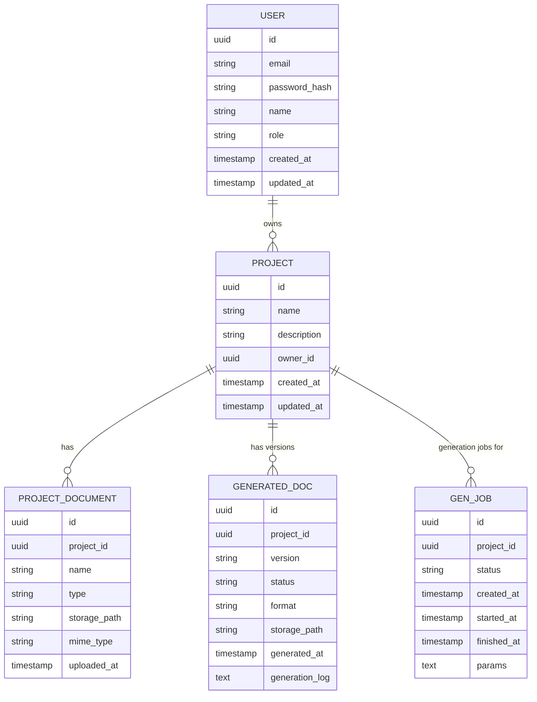
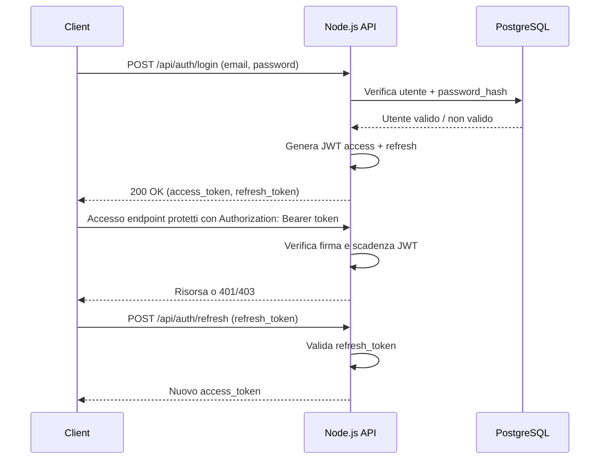

# Architettura - demo

**Versione:** 1.0  
**Data:** 17/01/2026  
**Autore:** Architect Agent  
**Stato:** Draft  

---

## 1. Panoramica del Sistema

L’applicazione **demo** è una soluzione full‑stack JavaScript pensata per generare e servire documentazione basata sui documenti di progetto.  
L’architettura segue un approccio **modulare a layer**:

- **Frontend (Presentation Layer)**: SPA React che permette agli utenti di:
  - caricare / selezionare documenti di progetto
  - configurare i parametri di generazione della documentazione
  - visualizzare, ricercare e scaricare la documentazione generata
- **Backend (Application + Business Layer)**: API REST Node.js (Express o Fastify) che:
  - espone endpoint per la gestione dei documenti
  - orchestri il processo di generazione della documentazione
  - gestisce autenticazione/ autorizzazione e validazione
- **Data Layer**: PostgreSQL per la persistenza di:
  - progetti, documenti sorgente, documentazione generata
  - utenti, ruoli, permessi
  - job di generazione, log e configurazioni

L’intero sistema è sviluppato in **TypeScript** (opzionale ma raccomandato) per ridurre errori runtime e migliorare manutenibilità.

---

## 2. Diagramma dei Componenti

```mermaid
flowchart TB
    subgraph Client[Presentation Layer]
        UI[React Web UI]
    end

    subgraph Server[Application & Business Layer - Node.js]
        API[REST API (Express/Fastify)]
        AUTH[Auth & Security Module]
        DOCSVC[Documentazione Service]
        PROJSVC[Progetti & Documenti Service]
        USERSVC[Utenti & Ruoli Service]
    end

    subgraph Storage[Data Layer]
        DB[(PostgreSQL)]
        FS[(Object Storage\n(es. S3/volume))]
    end

    UI -->|HTTPS JSON| API
    API --> AUTH
    API --> DOCSVC
    API --> PROJSVC
    API --> USERSVC

    DOCSVC --> DB
    DOCSVC --> FS
    PROJSVC --> DB
    PROJSVC --> FS
    USERSVC --> DB
```

---

## 3. Layer Architecture

### 3.1. Presentation Layer

- **Tecnologia:**  
  - React (CRA, Vite o Next.js in modalità SPA/CSR)  
  - TypeScript (fortemente consigliato)  
  - UI library: Material UI / Chakra / Bootstrap React
- **Responsabilità:**
  - Gestione routing lato client (React Router)
  - Gestione stato (React Query / Redux Toolkit / Zustand)
  - Interazione con API REST (fetch/axios)
  - Gestione sessione utente (storage token, refresh)
  - Upload documenti e configurazione job di generazione
  - Visualizzazione documentazione generata (HTML/Markdown/PDF)
  - Validazione lato client di form e input utenti

### 3.2. Application Layer (API)

- **Tecnologia:**  
  - Node.js LTS  
  - Express **oppure** Fastify (preferito per performance)  
  - TypeScript
- **Responsabilità:**
  - Definizione delle rotte REST (`/api/projects`, `/api/docs`, `/api/auth`, …)
  - Parsing richieste HTTP, validazione input (es. Zod / Joi / Yup)
  - Serialization delle risposte (JSON)
  - Gestione errori centralizzata e mapping in codici HTTP
  - Applicazione middleware cross‑cutting (log, CORS, rate limiting)
  - Autenticazione e autorizzazione (JWT, ruoli, permessi)
  - Delegare la logica ai servizi del Business Layer

### 3.3. Business Layer (Services / Domain)

- **Tecnologia:**  
  - Moduli/servizi Node.js in TypeScript, organizzati per bounded context:
    - `ProjectService`
    - `DocumentService`
    - `DocGenerationService`
    - `UserService`
    - `AuthService`
- **Responsabilità:**
  - Implementazione della logica di generazione documentazione:
    - aggregazione contenuti da documenti di progetto
    - applicazione template di documentazione
    - eventuale integrazione con motori di trasformazione (es. Markdown → HTML)
  - Regole di business su progetti, versioni documentazione, permessi di accesso
  - Gestione workflow di generazione (sincrona / asincrona con job)
  - Gestione transazioni applicative (a livello DB quando necessario)
  - Coordinamento tra Data Access Layer e infrastruttura (file storage)

### 3.4. Data Access Layer

- **Tecnologia:**  
  - PostgreSQL  
  - ORM / Query builder: Prisma / TypeORM / Knex (preferibile **Prisma** per DX)
- **Responsabilità:**
  - Mappatura schema dati (entità, relazioni, migrazioni)
  - Query ottimizzate verso PostgreSQL
  - Astrazione del DB verso i service (repository pattern)
  - Gestione connessioni (pooling) e transazioni
  - Persistenza dei metadati dei file, non dei file stessi (file → object storage)

---

## 4. Modello Dati



### 4.1. Entità Principali

| Entità          | Descrizione                                                                                 |
|-----------------|---------------------------------------------------------------------------------------------|
| `USER`          | Utente del sistema, con credenziali, ruolo (ADMIN/PM/USER) e metadati.                      |
| `PROJECT`       | Progetto applicativo o iniziativa per cui esiste documentazione.                           |
| `PROJECT_DOCUMENT` | Documento sorgente del progetto (requisiti, specifiche, ecc.), con path in storage.    |
| `GENERATED_DOC` | Artefatto di documentazione generato (es. “Architecture v1.0”), con stato e formato.       |
| `GEN_JOB`       | Job di generazione documentazione (asincrono), con parametri, stato e log di esecuzione.   |

---

## 5. API Strategy

### 5.1. REST Endpoints (indicativi)

| Endpoint                          | Method | Description                                                       | Auth              |
|----------------------------------|--------|-------------------------------------------------------------------|-------------------|
| `/api/auth/login`                | POST   | Autenticazione utente, ritorna JWT                               | Public            |
| `/api/auth/refresh`             | POST   | Refresh del token JWT                                            | JWT (refresh)     |
| `/api/users/me`                  | GET    | Dati utente corrente                                             | JWT               |
| `/api/projects`                  | GET    | Lista progetti dell’utente                                       | JWT               |
| `/api/projects`                  | POST   | Crea nuovo progetto                                              | JWT               |
| `/api/projects/{id}`             | GET    | Dettaglio progetto                                               | JWT               |
| `/api/projects/{id}`             | PUT    | Aggiorna progetto                                                | JWT (PM/ADMIN)    |
| `/api/projects/{id}/documents`   | POST   | Upload documento di progetto (multipart/form-data)               | JWT               |
| `/api/projects/{id}/documents`   | GET    | Lista documenti di progetto                                      | JWT               |
| `/api/projects/{id}/generate`    | POST   | Avvia job generazione documentazione                             | JWT               |
| `/api/gen-jobs/{jobId}`          | GET    | Stato job di generazione                                         | JWT               |
| `/api/generated-docs/{docId}`    | GET    | Metadati documentazione generata                                 | JWT               |
| `/api/generated-docs/{docId}/dl` | GET    | Download documentazione generata                                 | JWT (autorizzato) |

### 5.2. Authentication Flow



---

## 6. Security Architecture

### 6.1. Authentication

- **Tecnologia:**
  - JWT firmato con chiave privata/secret (HS256 o RS256)
  - Gestione refresh token (DB/Redis per revoca se necessario)
- **Meccanismi:**
  - Scadenza **access token** breve (es. 15–30 minuti)
  - Scadenza **refresh token** più lunga (es. 7–30 giorni)
  - Password:
    - Hashing con **bcrypt** / argon2
    - Policy password robuste
- **Session timeout:**
  - Timeout effettivo basato su scadenza token (8h solo se compatibile con policy di sicurezza)

### 6.2. Authorization

- **Role-based access control (RBAC):**
  - Ruoli: `ADMIN`, `PM`, `USER`
  - Permessi tipici:
    - `ADMIN`: gestione utenti, progetti, configurazioni globali
    - `PM`: gestione progetti, avvio generazioni, accesso a tutti i file del proprio progetto
    - `USER`: consultazione documenti dove è esplicitamente autorizzato
- **Implementazione:**
  - Middleware per controllo ruolo su base rotta
  - Controllo ownership per risorse (es. `project.owner_id == user.id` o ACL dedicata)

### 6.3. Data Protection

- **Trasporto:**
  - HTTPS obbligatorio in produzione (TLS terminato da reverse proxy / LB)
- **Protezione dati:**
  - Sanitizzazione input su server (es. uso di validator, escaping)
  - Limitazione dimensione upload file
  - Validazione MIME type dei file
  - Possibile cifratura a riposo dei file sensibili (encryption at rest su storage)
- **Misure aggiuntive:**
  - Protezione da CSRF non necessaria per API pure JWT, ma:
    - se usato cookie HttpOnly → adottare strategie anti-CSRF (SameSite, CSRF token)
  - Rate limiting su login e endpoint critici
  - Headers di sicurezza (Helmet: HSTS, X-Frame-Options, ecc.)

---

## 7. Architecture Decision Records (ADRs)

### ADR-001: Adozione stack Full-Stack JavaScript (Node.js + React + PostgreSQL)

- **Status:** Accepted  
- **Context:**  
  Il requisito impone uno stack full‑stack JavaScript con Node.js, React, PostgreSQL e (opzionalmente) TypeScript. È necessario uno stack coeso per frontend e backend, con un database relazionale.
- **Decision:**  
  - Backend in **Node.js** con **Express o Fastify** per API REST.  
  - Frontend in **React** SPA.  
  - Database relazionale **PostgreSQL**.  
  - Utilizzo di **TypeScript** su frontend e backend.
- **Consequences:**  
  - Positivi:
    - Unico linguaggio (TS/JS) su tutto lo stack → riduzione curva di apprendimento.
    - Ampio ecosistema librerie (Express/Fastify, React, ORM per PostgreSQL).
  - Negativi:
    - Necessità di attenzione a performance Node.js in carichi CPU‑bound (da mitigare con job asincroni o worker).
    - Tooling TypeScript da mantenere (build, tipi).

---

### ADR-002: Architettura a layer (Presentation, Application, Business, Data Access)

- **Status:** Accepted  
- **Context:**  
  Il sistema richiede chiara separazione delle responsabilità, facilità di estensione e testabilità. Sono presenti diversi ambiti: UI, API, logica dominio, persistenza.
- **Decision:**  
  Adozione di architettura **a layer**:
  - Presentation: React SPA
  - Application: API REST Node.js (routing, validazione, mapping HTTP)
  - Business: servizi dominio (documenti, progetti, generazione documentazione)
  - Data Access: moduli repository/ORM verso PostgreSQL
- **Consequences:**  
  - Positivi:
    - Migliore manutenibilità e test unitari per singoli layer.
    - Possibilità futura di sostituire front-end o DB con impatto limitato.
  - Negativi:
    - Maggior verbosità e boilerplate rispetto ad approccio “monolitico” non strutturato.

---

### ADR-003: Utilizzo di PostgreSQL come database principale

- **Status:** Accepted  
- **Context:**  
  Il sistema gestisce relazioni chiare tra progetti, utenti, documenti e versioni generate; sono richieste integrità referenziale e query complesse.
- **Decision:**  
  - Utilizzo di **PostgreSQL** come RDBMS principale.
  - Utilizzo di ORM/Query Builder (es. Prisma) per facilitare lo sviluppo.
- **Consequences:**  
  - Positivi:
    - Integrità referenziale e vincoli (FK, unique, ecc.).
    - Estensioni avanzate (JSONB, full-text search se necessario).
  - Negativi:
    - Richiede gestione migrazioni e tuning parametri DB.

---

### ADR-004: Gestione file tramite Object Storage esterno / filesystem

- **Status:** Accepted  
- **Context:**  
  I documenti del progetto e la documentazione generata possono essere voluminosi. Salvare file binari direttamente in DB non è efficiente né scalabile.
- **Decision:**  
  - Metadati dei file in PostgreSQL (path, tipo, checksum, permessi).  
  - Contenuto file in:
    - ambiente cloud: bucket S3‑compatibile  
    - ambiente on‑premise: volume dedicato / NAS
- **Consequences:**  
  - Positivi:
    - Scalabilità su grandi volumi di documenti.
    - Backup e versioning file gestibili a livello storage.
  - Negativi:
    - Gestione coerenza tra DB e storage (necessari meccanismi di clean‑up su errori).

---

### ADR-005: Autenticazione con JWT (access + refresh token)

- **Status:** Accepted  
- **Context:**  
  Necessità di autenticazione stateless, supporto a SPA e futura esposizione API a client multipli.
- **Decision:**  
  - Utilizzo di JWT firmato per l’**access token** (scadenza breve).
  - Utilizzo di **refresh token** per estendere sessione.
- **Consequences:**  
  - Positivi:
    - Scalabilità orizzontale del backend (nessuna sessione server stateful).
    - Integrazione semplice con SPA React.
  - Negativi:
    - Complessità nella revoca dei token (richiede blacklist o rotation).
    - Maggiore attenzione alla sicurezza di storage dei token lato client.

---

### ADR-006: Job di generazione documentazione asincroni

- **Status:** Accepted  
- **Context:**  
  La generazione di documentazione da documenti di progetto può essere costosa in termini di CPU/IO; è necessario garantire reattività del sistema.
- **Decision:**  
  - Le richieste di generazione creano un **job** (`GEN_JOB`) in stato `PENDING`.
  - Un worker (processo separato o queue consumer) esegue i job in background.
  - La UI interroga lo stato job e recupera il risultato una volta pronto.
- **Consequences:**  
  - Positivi:
    - L’API REST rimane responsiva.
    - Migliore controllo di carico, possibilità di parallelizzare i worker.
  - Negativi:
    - Maggior complessità architetturale (code / scheduler, monitoraggio job).

---

## 8. Scalability & Performance

### 8.1. Caching Strategy

- **Livello API / Business:**
  - Cache in memoria (es. `node-cache` o Redis) per:
    - configurazioni statiche
    - elenco progetti e permessi per utente (con TTL breve)
  - Caching dei risultati di lettura documentazione generata frequentemente richiesta.
- **Invalidazione cache:**
  - Event‑based: all’aggiornamento di un progetto o nuova generazione documenti, invalidare le chiavi correlate.
- **HTTP Caching:**
  - ETag / Last‑Modified per risorse statiche e documenti generati.
  - Cache‑Control per contenuti scaricabili.

### 8.2. Database Optimization

- **Schema:**
  - Indici su:
    - `USER.email`
    - `PROJECT.owner_id`
    - `PROJECT_DOCUMENT.project_id`
    - `GENERATED_DOC.project_id`
    - `GEN_JOB.project_id`, `GEN_JOB.status`
- **Accesso:**
  - Uso di paginazione per liste (es. progetti, documenti).
  - Evitare N+1 query tramite join o prefetch ORM.
- **Connessioni:**
  - Connection pooling configurato (es. tramite pg‑pool o driver ORM).
  - Parametri di timeout per evitare lock prolungati.

### 8.3. Scalabilità

- **Backend Node.js:**
  - Containerizzazione (Docker) e scalabilità orizzontale (più istanze dietro un load balancer).
  - Possibile utilizzo di `node:cluster` o processi multipli per sfruttare CPU multiple.
- **Frontend:**
  - Build statiche React servite da CDN o reverse proxy performante (Nginx).
- **Job di generazione:**
  - Worker scalabili separatamente (es. N pod dedicati in Kubernetes).
  - Utilizzo eventuale di message broker (es. RabbitMQ / Redis Streams) per code.

---

## 9. Deployment Strategy

### 9.1. Environment

- **Containerizzazione:**
  - Immagini Docker separate:
    - `demo-api` (Node.js backend)
    - `demo-worker` (job generazione)
    - `demo-frontend` (build React servita da Nginx o Node static server)
  - `postgres` come servizio DB
- **Cloud target:**
  - Cloud Run, GKE o equivalente (AKS/EKS):
    - backend e worker come servizi/pod
    - DB PostgreSQL gestito (Cloud SQL / RDS) o cluster dedicato
  - Storage:
    - Bucket S3‑compatibile per documenti
- **Configurazione:**
  - Variabili ambiente per segreti (JWT secret, credenziali DB, endpoint storage)
  - ConfigMap / Secrets in ambiente Kubernetes

### 9.2. CI/CD Pipeline

```mermaid
flowchart LR
    Dev[Developer Push Git] --> CI[CI Server]
    CI --> Build[Build & Lint\n(Frontend+Backend)]
    Build --> Test[Unit & Integration Tests]
    Test --> DockerBuild[Build Docker Images]
    DockerBuild --> Registry[Push to Container Registry]
    Registry --> Deploy[Deploy to Staging/Prod]
```

- Step:
  - Lint + test automatizzati (Jest, React Testing Library, ecc.)
  - Migrazioni DB automatiche in staging, manuali/approvate in produzione
  - Deploy canary/rolling upgrade per minimizzare downtime

---

## 10. Monitoring & Observability

- **Logging:**
  - Backend Node.js:
    - Logger strutturato (es. Pino / Winston) in formato JSON.
    - Correlazione richieste con request ID.
  - Worker:
    - Log separati per job generazione, con `generation_log` salvato in DB.
- **Metrics:**
  - Esposizione metriche (es. Prometheus) su:
    - tempi risposta API
    - throughput richieste
    - job per stato (`PENDING`, `RUNNING`, `FAILED`, `COMPLETED`)
  - Monitoraggio PostgreSQL (connessioni, slow queries).
- **Tracing:**
  - Facoltativo ma raccomandato: OpenTelemetry per tracciare flusso da API a DB / worker.
- **Alerts:**
  - Allarmi su:
    - tasso errori 5xx
    - latenza media oltre soglia
    - code job in crescita anomala
    - spazio storage quasi esaurito

---

Questa architettura è allineata allo stack richiesto (Node.js, React, PostgreSQL, TypeScript opzionale) e copre esplicitamente sicurezza, performance e scalabilità, fornendo ADR documentate per le decisioni principali.