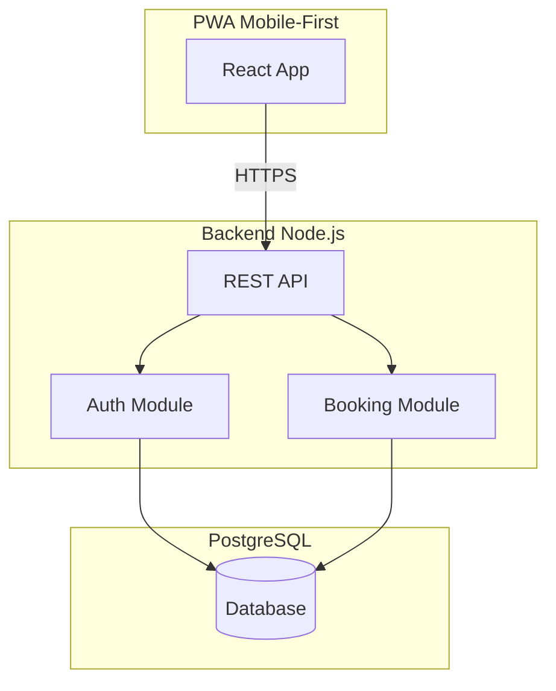
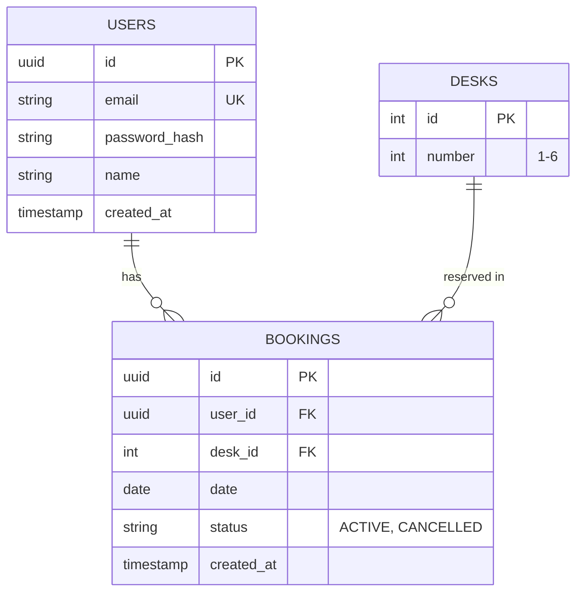
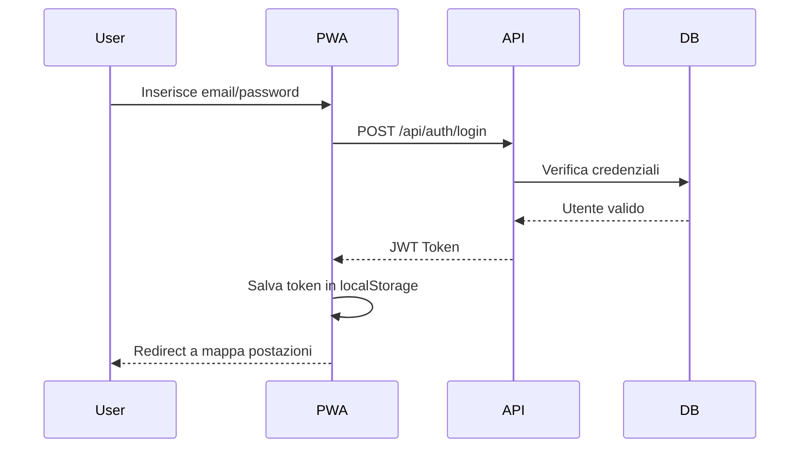

# Architettura - SmartDesk Coworking MVP

**Versione:** 2.0  
**Data:** 19/01/2026  
**Autore:** Architect Agent  
**Stato:** Approvato  

---

## 1. Panoramica del Sistema

**SmartDesk Coworking** è una PWA mobile-first per la prenotazione di postazioni in un coworking con 6 posti.

L'architettura è **semplice e minimalista**, adatta a un MVP:

- **Frontend**: React SPA (PWA) con visualizzazione mappa postazioni
- **Backend**: Node.js API REST per autenticazione e gestione prenotazioni
- **Database**: PostgreSQL con 3 tabelle (Users, Desks, Bookings)

---

## 2. Diagramma dei Componenti

---

## 3. Layer Architecture

### 3.1. Presentation Layer (Frontend)
- **Tecnologia:** React 18 + TypeScript
- **PWA:** Service Worker per offline capability
- **UI:** Griglia 2x3 per visualizzazione 6 postazioni
- **Responsabilità:**
  - Login form
  - Mappa postazioni (verde/rosso)
  - Lista prenotazioni utente
  - Selettore data (giorni feriali)

### 3.2. Application Layer (Backend)
- **Tecnologia:** Node.js + Express
- **Responsabilità:**
  - REST API endpoints
  - Validazione input
  - Autenticazione JWT
  - Business logic prenotazioni

### 3.3. Data Layer
- **Tecnologia:** PostgreSQL + Prisma
- **Tabelle:** Users, Desks, Bookings

---

## 4. Modello Dati

---

## 5. API Endpoints

| Endpoint | Method | Descrizione | Auth |
|----------|--------|-------------|------|
| `/api/auth/login` | POST | Login utente | No |
| `/api/auth/me` | GET | Dati utente corrente | JWT |
| `/api/desks` | GET | Lista 6 postazioni | JWT |
| `/api/desks/availability` | GET | Disponibilità per data | JWT |
| `/api/bookings` | GET | Prenotazioni utente | JWT |
| `/api/bookings` | POST | Crea prenotazione | JWT |
| `/api/bookings/:id` | DELETE | Cancella prenotazione | JWT |

---

## 6. Authentication Flow

---

## 7. Security

### 7.1. Authentication
- JWT con scadenza 8h
- Password hashate con bcrypt
- Utenti pre-registrati (no signup)

### 7.2. Authorization
- Ogni utente vede solo le proprie prenotazioni
- Può cancellare solo se mancano > 24h

### 7.3. Vincoli Business
- Max 1 prenotazione per utente per giorno
- Weekend automaticamente bloccato

---

## 8. ADR (Architecture Decision Records)

### ADR-001: Stack Full-Stack JavaScript
- **Status:** Accepted
- **Decision:** Node.js + React + PostgreSQL
- **Rationale:** Semplicità, unico linguaggio, ampio ecosistema

### ADR-002: PWA Mobile-First
- **Status:** Accepted
- **Decision:** React PWA invece di app native
- **Rationale:** MVP veloce, cross-platform, installabile

### ADR-003: Autenticazione JWT Stateless
- **Status:** Accepted
- **Decision:** JWT senza refresh token per MVP
- **Rationale:** Semplicità, scadenza 8h sufficiente per uso giornaliero

### ADR-004: 6 Postazioni Fisse
- **Status:** Accepted
- **Decision:** Griglia 2x3 hardcoded
- **Rationale:** MVP scope, espandibile in futuro

---

## 9. Deployment

- **Container:** Docker
- **Hosting:** Cloud Run / Vercel / Railway
- **Database:** Managed PostgreSQL (Supabase / Neon)

---

## 10. Scalabilità Futura

Non necessaria per MVP. Se richiesta:
- Aggiungere più postazioni (configurabile)
- Multi-sede
- Admin panel
- Notifiche push
