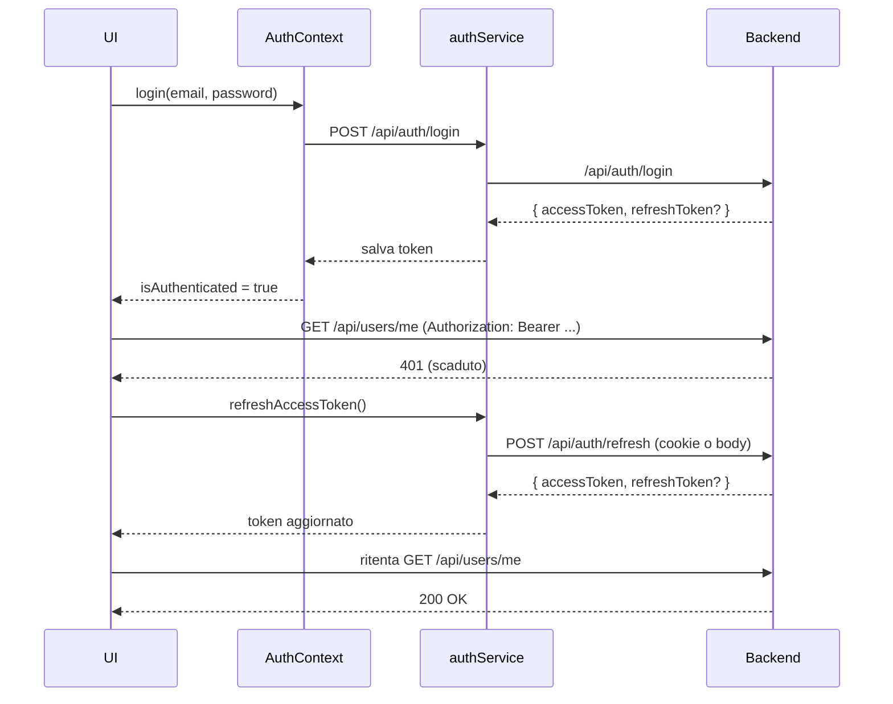

# Autenticazione Frontend (PWA) – Gestione JWT

Versione: 1.0
Data: 18/01/2026
Autore: Frontend Team
Stato: Draft

---

1. Scopo

Questo documento descrive l’architettura e l’implementazione della gestione autenticazione nella PWA (frontend React), con focus su:
- componenti principali: AuthContext, authService, ProtectedRoute, tokenStorage
- flussi di login e signup
- salvataggio e uso dei token (access/refresh) e implicazioni di sicurezza
- allegare i token alle richieste e gestione auto‑refresh
- logout e pulizia dei token
- come proteggere nuove route
- TODO e miglioramenti futuri

Si allinea alla documentazione backend: docs/authentication-jwt.md (JWT, refresh) e alla struttura in docs/source-tree.md.

---

2. Architettura Frontend

Struttura prevista (vedi docs/source-tree.md):
- frontend/src/features/auth/
  - pages/LoginPage.tsx
  - components/LoginForm.tsx
  - api/authApi.ts
  - state/AuthContext.tsx
- frontend/src/app/routes.tsx (definizione routing)
- frontend/src/hooks/useAuth.ts (helper opzionale)
- frontend/src/app/config/api.ts (base URL + http client)
- frontend/src/features/auth/tokenStorage.ts (persistenza token)

Componenti:
- AuthContext: fornisce lo stato di autenticazione (user, accessToken, isAuthenticated) e le azioni (login, signup, logout, refresh).
- authService: incapsula le chiamate API /api/auth/login, /api/auth/refresh e /api/users (signup), e normalizza le risposte (accessToken, refreshToken, profilo utente).
- ProtectedRoute: wrapper di React Router che consente l’accesso solo se autenticati, con redirect automatico a /login in caso contrario.
- tokenStorage: astrazione per salvare/caricare/invalidare i token in modo consistente (localStorage/sessionStorage/cookie) e per condividerli tra tab.

---

3. Conservazione dei token e sicurezza

3.1. Cosa salviamo
- accessToken (JWT con scadenza breve): usato nell’header Authorization per le API protette.
- refreshToken (JWT con scadenza più lunga): usato per ottenere un nuovo accessToken.

3.2. Dove salviamo
- Modalità consigliata (allineata al backend):
  - accessToken: in memoria (stato React) e, opzionalmente, in sessionStorage per persistenza sessione browser. Evitare localStorage se possibile per ridurre l’impatto di XSS.
  - refreshToken: via cookie HttpOnly gestito dal backend (vedi docs/authentication-jwt.md). In questo caso il frontend non ha accesso diretto al token e invia le credenziali del cookie automaticamente (withCredentials) verso /api/auth/refresh.
- Modalità fallback (se il backend non usa cookie):
  - accessToken: sessionStorage (default) o localStorage (consapevoli dei rischi XSS).
  - refreshToken: localStorage (temporaneo, da migrare a cookie HttpOnly appena possibile).

3.3. Implicazioni di sicurezza
- localStorage è vulnerabile a XSS: limitare, sanitizzare input, Content Security Policy, e preferire sessionStorage o memoria dove possibile.
- Se si usa cookie HttpOnly per refresh:
  - abilitare CORS con credenziali (withCredentials) e limitare origin, impostare Secure e SameSite (Lax/Strict) in produzione.

---

4. tokenStorage (API suggerita)

File: frontend/src/features/auth/tokenStorage.ts

Responsabilità:
- Astrarre il meccanismo di persistenza dei token.
- Esporre un’interfaccia uniforme al resto dell’app.

Esempio (TypeScript):

```ts
export type StorageMode = "memory+session" | "local";

let memoryAccessToken: string | null = null;

const ACCESS_KEY = "auth.accessToken";
const REFRESH_KEY = "auth.refreshToken"; // usato solo in modalità fallback

export const tokenStorage = {
  mode: (process.env.REACT_APP_AUTH_STORAGE_MODE as StorageMode) || "memory+session",

  getAccessToken(): string | null {
    if (this.mode === "memory+session") {
      return memoryAccessToken ?? sessionStorage.getItem(ACCESS_KEY);
    }
    return localStorage.getItem(ACCESS_KEY);
  },

  setAccessToken(token: string | null) {
    memoryAccessToken = token;
    if (this.mode === "memory+session") {
      if (token) sessionStorage.setItem(ACCESS_KEY, token);
      else sessionStorage.removeItem(ACCESS_KEY);
    } else {
      if (token) localStorage.setItem(ACCESS_KEY, token);
      else localStorage.removeItem(ACCESS_KEY);
    }
  },

  // Fallback solo se il backend non usa cookie HttpOnly
  getRefreshToken(): string | null {
    return localStorage.getItem(REFRESH_KEY);
  },
  setRefreshToken(token: string | null) {
    if (token) localStorage.setItem(REFRESH_KEY, token);
    else localStorage.removeItem(REFRESH_KEY);
  },

  clearAll() {
    memoryAccessToken = null;
    sessionStorage.removeItem(ACCESS_KEY);
    localStorage.removeItem(ACCESS_KEY);
    localStorage.removeItem(REFRESH_KEY);
  },
};
```

Note:
- In produzione si consiglia di non usare localStorage per il refreshToken, preferire cookie HttpOnly lato backend.

---

5. authService (API suggerita)

File: frontend/src/features/auth/api/authApi.ts (o authService.ts)

Responsabilità:
- Chiamare le API di autenticazione.
- Gestire l’aggiornamento dei token lato client.

Endpoint previsti:
- POST /api/auth/login
- POST /api/auth/refresh (senza Authorization; usa cookie o body)
- POST /api/users (signup/registrazione utente)

Esempio:

```ts
import { tokenStorage } from "../tokenStorage";

const API_BASE = process.env.REACT_APP_API_BASE_URL || "/api";

export async function login(email: string, password: string) {
  const res = await fetch(`${API_BASE}/auth/login`, {
    method: "POST",
    headers: { "Content-Type": "application/json" },
    body: JSON.stringify({ email, password }),
    credentials: "include", // necessario se refresh via cookie
  });
  if (!res.ok) throw new Error("LOGIN_FAILED");
  const data = await res.json();
  tokenStorage.setAccessToken(data.accessToken);
  // Solo in fallback (niente cookie HttpOnly)
  if (data.refreshToken) tokenStorage.setRefreshToken(data.refreshToken);
  return data;
}

export async function signup(email: string, password: string) {
  const res = await fetch(`${API_BASE}/users`, {
    method: "POST",
    headers: { "Content-Type": "application/json" },
    body: JSON.stringify({ email, password }),
  });
  if (!res.ok) throw new Error("SIGNUP_FAILED");
  // Opzione A: backend richiede verifica email → non si auto‑logga
  // Opzione B: backend ritorna token → eseguire setAccessToken/refreshToken come il login
  return res.json();
}

export async function refreshAccessToken() {
  const bodyOrInit: RequestInit = {
    method: "POST",
    headers: { "Content-Type": "application/json" },
    credentials: "include", // invia cookie refresh se presente
  };

  // Fallback: invio refreshToken nel body
  const rt = tokenStorage.getRefreshToken();
  if (rt) {
    bodyOrInit.body = JSON.stringify({ refreshToken: rt });
  }

  const res = await fetch(`${API_BASE}/auth/refresh`, bodyOrInit);
  if (!res.ok) throw new Error("REFRESH_FAILED");
  const data = await res.json();
  tokenStorage.setAccessToken(data.accessToken);
  if (data.refreshToken) tokenStorage.setRefreshToken(data.refreshToken);
  return data.accessToken as string;
}
```

---

6. Allegare il token alle richieste + auto‑refresh

Suggerimento: centralizzare le chiamate HTTP (fetch wrapper o axios) per:
- inserire Authorization: Bearer <accessToken>
- intercettare 401, tentare un refresh una sola volta e ripetere la richiesta

Esempio fetch wrapper semplice:

```ts
import { tokenStorage } from "../features/auth/tokenStorage";
import { refreshAccessToken } from "../features/auth/api/authApi";

export async function http(input: RequestInfo, init: RequestInit = {}) {
  const withAuth = async (): Promise<Response> => {
    const token = tokenStorage.getAccessToken();
    const headers = new Headers(init.headers || {});
    if (token) headers.set("Authorization", `Bearer ${token}`);
    return fetch(input, { ...init, headers, credentials: "include" });
  };

  let res = await withAuth();
  if (res.status === 401) {
    try {
      await refreshAccessToken();
      res = await withAuth();
    } catch {
      // refresh fallito → propagare 401 e demandare a logout
      throw new Error("UNAUTHORIZED");
    }
  }
  return res;
}
```

---

7. AuthContext e ProtectedRoute

7.1. AuthContext (schema)

```ts
import React, { createContext, useContext, useEffect, useState } from "react";
import { login as apiLogin } from "../api/authApi";
import { tokenStorage } from "../tokenStorage";

interface AuthState {
  isAuthenticated: boolean;
  accessToken: string | null;
  user: { id: string; email: string } | null; // opzionale, caricato da /api/users/me
}

interface AuthActions {
  login(email: string, password: string): Promise<void>;
  logout(): void;
}

const AuthContext = createContext<(AuthState & AuthActions) | undefined>(undefined);

export const AuthProvider: React.FC<{ children: React.ReactNode }> = ({ children }) => {
  const [accessToken, setAccessToken] = useState<string | null>(tokenStorage.getAccessToken());

  useEffect(() => {
    // Sync iniziale token dallo storage
    setAccessToken(tokenStorage.getAccessToken());
  }, []);

  const login = async (email: string, password: string) => {
    await apiLogin(email, password);
    setAccessToken(tokenStorage.getAccessToken());
  };

  const logout = () => {
    tokenStorage.clearAll();
    setAccessToken(null);
    // opzionale: redirect a /login
  };

  const value = {
    isAuthenticated: !!accessToken,
    accessToken,
    user: null, // si può popolare con /api/users/me
    login,
    logout,
  };

  return <AuthContext.Provider value={value}>{children}</AuthContext.Provider>;
};

export const useAuth = () => {
  const ctx = useContext(AuthContext);
  if (!ctx) throw new Error("useAuth must be used within AuthProvider");
  return ctx;
};
```

7.2. ProtectedRoute (React Router v6)

```tsx
import { Navigate } from "react-router-dom";
import { useAuth } from "../state/AuthContext";

export const ProtectedRoute: React.FC<{ children: JSX.Element }> = ({ children }) => {
  const { isAuthenticated } = useAuth();
  if (!isAuthenticated) return <Navigate to="/login" replace />;
  return children;
};
```

7.3. Uso nel router

```tsx
// frontend/src/app/routes.tsx
import { Routes, Route } from "react-router-dom";
import { ProtectedRoute } from "../features/auth/components/ProtectedRoute";
import DashboardPage from "../features/projects/pages/ProjectListPage";
import LoginPage from "../features/auth/pages/LoginPage";

export function AppRoutes() {
  return (
    <Routes>
      <Route path="/login" element={<LoginPage />} />
      <Route
        path="/"
        element={
          <ProtectedRoute>
            <DashboardPage />
          </ProtectedRoute>
        }
      />
    </Routes>
  );
}
```

---

8. Flussi principali

8.1. Login
- Utente compila il form LoginForm → chiama AuthContext.login → authService.login
- Se OK: salvataggio accessToken (e refreshToken se in fallback), update stato, redirect a home/dashboard
- Se KO: mostra errore

8.2. Signup
- Utente compila il form di registrazione → POST /api/users
- Esiti:
  - Registrazione con verifica email: mostra messaggio "Verifica la tua email" e redirect a login
  - Registrazione con auto‑login: il backend ritorna i token → salvarli come in login e proseguire

8.3. Auto‑refresh alla prima 401
- http wrapper rileva 401 → chiama /api/auth/refresh (cookie o body)
- Se OK: salva nuovo accessToken (e refreshToken se presente) e ritenta la richiesta
- Se KO: emette errore → l’app esegue logout e redirect a /login

8.4. Logout
- Chiamare AuthContext.logout: pulisce tokenStorage (access/refresh) e stato, redirect a /login

8.5. Sequenza logica (schematica)



---

9. Come aggiungere nuove route protette

- Creare la pagina React della feature (es. ProjectListPage.tsx)
- Nel router, avvolgere la route con ProtectedRoute (vedi 7.3)
- Nelle chiamate HTTP della feature, usare sempre il wrapper http che allega l’Authorization

Snippet:

```tsx
<Route
  path="/projects"
  element={
    <ProtectedRoute>
      <ProjectListPage />
    </ProtectedRoute>
  }
/>
```

---

10. TODO e miglioramenti futuri

- Passaggio definitivo a cookie HttpOnly per il refresh token (eliminare uso di localStorage per refreshToken)
- Implementare refresh token rotation (gestita lato backend, con jti e revoche) e gestione 409 REFRESH_TOKEN_REUSE
- Auto‑logout alla scadenza dell’access token (timer basato su exp) e sincronizzazione multi‑tab (BroadcastChannel o storage events)
- Aggiungere ruolo/permessi nel contesto e ProtectedRoute con guard su ruoli (es. requireRole="ADMIN")
- Migliorare sicurezza: CSP rigorosa, sanitize input, limitazione dipendenze, SRI per asset
- Telemetria non sensibile: mai loggare token, password o PII

---

11. Riferimenti

- Backend JWT e refresh: docs/authentication-jwt.md
- Struttura progetto: docs/source-tree.md (sezione 6 – Struttura Frontend)
- RFC 7519 – JSON Web Token (JWT)
