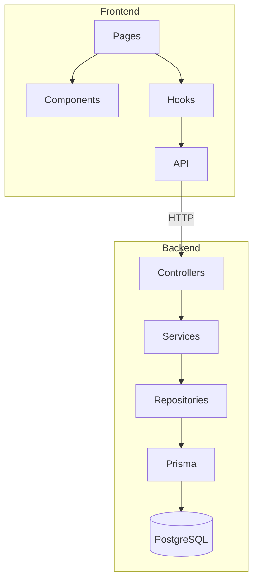

# Source Tree - SmartDesk Coworking MVP

**Versione:** 2.0  
**Data:** 19/01/2026  
**Autore:** Architect Agent  

---

## 1. Struttura Progetto

```text
smartdesk/
├── frontend/                 # React PWA
│   ├── src/
│   │   ├── components/       # Componenti UI riusabili
│   │   ├── pages/            # Pagine/Route
│   │   ├── hooks/            # Custom hooks
│   │   ├── api/              # API calls
│   │   ├── types/            # TypeScript types
│   │   ├── App.tsx
│   │   └── main.tsx
│   ├── public/
│   │   └── manifest.json     # PWA manifest
│   ├── package.json
│   └── vite.config.ts
│
├── backend/                  # Node.js API
│   ├── src/
│   │   ├── controllers/      # Route handlers
│   │   ├── services/         # Business logic
│   │   ├── repositories/     # Data access
│   │   ├── middleware/       # Auth, validation
│   │   ├── types/            # DTOs, interfaces
│   │   ├── utils/            # Helpers
│   │   └── index.ts          # Entry point
│   ├── prisma/
│   │   ├── schema.prisma     # Database schema
│   │   └── migrations/       # DB migrations
│   ├── package.json
│   └── tsconfig.json
│
├── docs/                     # Documentazione
│   ├── architecture.md
│   ├── tech-stack.md
│   ├── coding-standards.md
│   └── source-tree.md
│
├── .github/
│   └── workflows/
│       └── ci.yml            # CI/CD pipeline
│
└── README.md
```

---

## 2. Frontend Structure

```text
frontend/src/
├── components/
│   ├── DeskGrid.tsx          # Griglia 2x3 postazioni
│   ├── DeskCard.tsx          # Singola postazione
│   ├── DatePicker.tsx        # Selettore data
│   ├── BookingList.tsx       # Lista prenotazioni
│   └── Layout.tsx            # Layout comune
│
├── pages/
│   ├── LoginPage.tsx         # Login form
│   ├── DeskMapPage.tsx       # Mappa postazioni
│   └── MyBookingsPage.tsx    # Le mie prenotazioni
│
├── hooks/
│   ├── useAuth.ts            # Auth state & methods
│   └── useBookings.ts        # Booking CRUD
│
├── api/
│   ├── auth.ts               # /api/auth/*
│   ├── desks.ts              # /api/desks/*
│   └── bookings.ts           # /api/bookings/*
│
├── types/
│   ├── user.ts               # User, LoginRequest
│   ├── desk.ts               # Desk, DeskAvailability
│   └── booking.ts            # Booking, CreateBookingDto
│
├── App.tsx                   # Routes + Providers
└── main.tsx                  # Entry point
```

---

## 3. Backend Structure

```text
backend/src/
├── controllers/
│   ├── auth.controller.ts    # Login endpoint
│   ├── desks.controller.ts   # Desks & availability
│   └── bookings.controller.ts # Booking CRUD
│
├── services/
│   ├── auth.service.ts       # JWT, password verify
│   ├── desks.service.ts      # Desk availability logic
│   └── bookings.service.ts   # Booking business rules
│
├── repositories/
│   ├── users.repository.ts   # User queries
│   ├── desks.repository.ts   # Desk queries
│   └── bookings.repository.ts # Booking queries
│
├── middleware/
│   ├── auth.middleware.ts    # JWT verification
│   ├── validate.middleware.ts # Zod validation
│   └── error.middleware.ts   # Error handler
│
├── types/
│   ├── dtos.ts               # Request/Response DTOs
│   └── errors.ts             # Custom error classes
│
├── utils/
│   ├── jwt.ts                # JWT helpers
│   ├── password.ts           # bcrypt helpers
│   └── date.ts               # Weekend check
│
├── routes.ts                 # Route registration
└── index.ts                  # Server bootstrap
```

---

## 4. Database Schema (Prisma)

```text
backend/prisma/
├── schema.prisma             # Main schema file
└── migrations/
    └── 001_initial/
        └── migration.sql     # Initial tables
```

---

## 5. Dove Aggiungere Nuovo Codice

| Tipo | Percorso |
|------|----------|
| Nuovo componente UI | `frontend/src/components/` |
| Nuova pagina | `frontend/src/pages/` |
| Nuova API call | `frontend/src/api/` |
| Nuovo endpoint | `backend/src/controllers/` |
| Nuova business logic | `backend/src/services/` |
| Nuova query DB | `backend/src/repositories/` |
| Nuovo middleware | `backend/src/middleware/` |
| Modifica DB schema | `backend/prisma/schema.prisma` |

---

## 6. Flusso Dipendenze



**Regole:**
- Controller → Service → Repository (mai saltare livelli)
- Components non chiamano API direttamente (usano Hooks)
- Business logic solo nei Services
