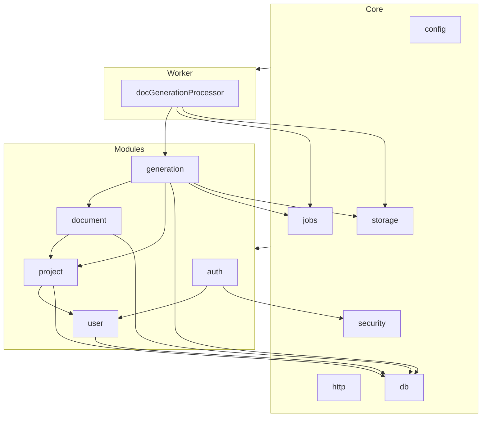

# Source Tree - demo

**Versione:** 1.0  
**Data:** 17/01/2026  
**Autore:** Architect Agent  

---

## 1. Introduzione

Questo documento descrive l’organizzazione del codice sorgente del progetto **demo**, allineata all’architettura definita (frontend React, backend Node.js/Express/Fastify, PostgreSQL, job asincroni).  
Si segue il pattern **Package-by-Feature** (organizzazione per feature/modulo) e una chiara separazione tra:

- **Core layer** (infra, configurazioni, componenti condivisi)
- **Modules layer** (feature di business: progetti, documenti, generazione, utenti, auth)
- **Frontend** (SPA React)
- **Worker** per job di generazione documentazione

> Nota: il repository attuale mostra solo `.github/` e `docs_re/`. La seguente struttura è la **struttura target** raccomandata per implementare l’architettura definita.

---

## 2. Panoramica della Struttura

```text
demo/
├── .github/                     # Workflow CI/CD, issue template, ecc.
├── docs_re/                     # Documentazione di riferimento (architettura, ADR, source tree, ecc.)
├── backend/                     # API REST + Business layer + Data layer
│   ├── src/
│   │   ├── core/                # Core & infrastruttura condivisa
│   │   ├── modules/             # Moduli business (package-by-feature)
│   │   ├── worker/              # Job worker per generazione documentazione
│   │   └── index.ts             # Entrypoint API
│   ├── prisma/                  # Schema DB e migrazioni (se si usa Prisma)
│   ├── test/                    # Test unitari / integrazione backend
│   ├── package.json
│   └── tsconfig.json
├── frontend/                    # React SPA (Presentation layer)
│   ├── src/
│   ├── public/
│   ├── package.json
│   └── tsconfig.json
├── infra/                       # Script ops, docker, k8s, configurazioni deployment
│   ├── docker/
│   └── k8s/
├── .editorconfig
├── .eslintrc.cjs
├── .prettierrc
├── package.json                 # Monorepo root (se workspace npm/pnpm/yarn)
└── README.md
```

---

## 3. Core Layer (Backend)

Componenti condivisi e cross‑cutting del backend (config, logging, sicurezza, error handling, accesso DB).

```text
backend/src/core/
├── config/                      # Configurazioni applicative
│   ├── env.ts                   # Caricamento variabili ambiente (dotenv, validazione schema)
│   ├── appConfig.ts             # Config runtime (porta, CORS, rate-limit, ecc.)
│   ├── dbConfig.ts              # Config connessione PostgreSQL
│   └── securityConfig.ts        # Parametri sicurezza (JWT, password policy, ecc.)
├── http/                        # HTTP server & middleware comuni
│   ├── server.ts                # Creazione server Express/Fastify, bootstrap middleware
│   ├── routes.ts                # Registrazione rotte globali (aggrega rotte moduli)
│   ├── middleware/
│   │   ├── errorHandler.ts      # Gestione errori centralizzata
│   │   ├── requestLogger.ts     # Logging richieste HTTP
│   │   ├── authGuard.ts         # Verifica JWT, ruoli, permessi
│   │   ├── validation.ts        # Validazione input (Zod/Joi/Yup)
│   │   └── rateLimiter.ts       # Rate limiting (login, endpoint critici)
│   └── dto/                     # DTO comuni / response standard
│       ├── ApiResponse.ts
│       └── PaginationDto.ts
├── db/                          # Data access layer condiviso
│   ├── client.ts                # Istanza client Prisma/Knex/TypeORM
│   ├── migrations/              # Migrazioni SQL/ORM
│   │   ├── 001_init.sql
│   │   └── 002_add_generation_tables.sql
│   └── repositories/            # Repositories generici / base
│       ├── BaseRepository.ts
│       └── TransactionManager.ts
├── security/                    # Componenti di sicurezza
│   ├── jwtService.ts            # Creazione e validazione JWT (access/refresh)
│   ├── passwordHasher.ts        # bcrypt/argon2 helper
│   └── rbac.ts                  # Definizione ruoli e permessi (ADMIN, PM, USER)
├── storage/                     # Accesso allo storage documenti
│   ├── fileStorage.ts           # Interfaccia generica (save, get, delete)
│   ├── s3Storage.ts             # Implementazione S3‑compatibile
│   └── localStorage.ts          # Implementazione filesystem locale
├── logging/                     # Logging & observability
│   ├── logger.ts                # Istanza logger (Pino/Winston)
│   └── requestContext.ts        # Correlazione ID richiesta, contesto
├── jobs/                        # Infrastruttura job asincroni
│   ├── jobQueue.ts              # Abstr. coda (Redis, RabbitMQ, in‑process)
│   ├── jobTypes.ts              # Tipi di job (GEN_DOC, CLEANUP, ecc.)
│   └── jobRunner.ts             # Esecuzione generica job
└── util/                        # Utility condivise
    ├── result.ts                # Helper per risultati (success/failure)
    ├── errors.ts                # Errori di dominio/globali
    └── dateUtils.ts
```

**Ruolo del Core Layer:**

- Non conosce le entità funzionali specifiche (Project, Document, ecc.) se non dove strettamente necessario (es. mapping generico).  
- Fornisce servizi infrastrutturali usati dai moduli (`UserModule`, `ProjectModule`, `DocumentModule`, ecc.).

---

## 4. Modules Layer (Backend)

I moduli business sono organizzati per feature, seguendo una struttura uniforme.

### 4.1. Pattern di Struttura per Modulo

```text
backend/src/modules/{module-name}/
├── api/                         # Layer Application: controller REST / route handlers
│   ├── {module}.routes.ts       # Definizione rotte (path, middleware)
│   └── {Module}Controller.ts    # Handler richieste HTTP
├── domain/                      # Modello dominio + logica di business
│   ├── entities/
│   │   └── {Entity}.ts          # Entità dominio (Project, GeneratedDoc, ...)
│   ├── services/
│   │   └── {Module}Service.ts   # Logica business principale
│   ├── policies/                # Regole di autorizzazione/validazione specifiche
│   └── events/                  # Eventi dominio (es. DocGeneratedEvent)
├── dto/                         # Data Transfer Objects (request/response)
│   ├── requests/
│   │   └── {Action}RequestDto.ts
│   └── responses/
│       └── {Action}ResponseDto.ts
├── mappers/                     # Mapping Entity <-> DTO
│   └── {Module}Mapper.ts
├── repository/                  # Accesso dati specifico al modulo
│   └── {Module}Repository.ts
└── tests/                       # Test specifici del modulo
    ├── {Module}Service.spec.ts
    └── {Module}Controller.spec.ts
```

### 4.2. Moduli Previsti

Allineati al modello dati e alle API descritte in architettura.

```text
backend/src/modules/
├── auth/                        # Login, refresh token, gestione sessione
│   ├── api/
│   │   └── authController.ts    # /api/auth/login, /api/auth/refresh, logout
│   ├── domain/
│   │   ├── services/
│   │   │   └── authService.ts   # Verifica credenziali, generazione token
│   │   └── entities/
│   │       └── AuthSession.ts   # (se si gestiscono sessioni/refresh in DB)
│   ├── dto/
│   │   ├── requests/LoginRequestDto.ts
│   │   ├── responses/LoginResponseDto.ts
│   │   └── responses/RefreshTokenResponseDto.ts
│   ├── repository/
│   │   └── AuthSessionRepository.ts
│   └── mappers/
│       └── AuthMapper.ts
├── user/                        # Utenti e ruoli
│   ├── api/
│   │   └── userController.ts    # /api/users/me, /api/users/...
│   ├── domain/
│   │   ├── entities/User.ts
│   │   └── services/UserService.ts
│   ├── dto/
│   │   ├── UserDto.ts
│   │   └── CreateUserRequestDto.ts
│   ├── repository/
│   │   └── UserRepository.ts
│   └── mappers/
│       └── UserMapper.ts
├── project/                     # Gestione progetti
│   ├── api/
│   │   └── projectController.ts # /api/projects, /api/projects/{id}
│   ├── domain/
│   │   ├── entities/Project.ts
│   │   └── services/ProjectService.ts
│   ├── dto/
│   │   ├── ProjectDto.ts
│   │   └── UpsertProjectRequestDto.ts
│   ├── repository/
│   │   └── ProjectRepository.ts
│   └── mappers/
│       └── ProjectMapper.ts
├── document/                    # Documenti sorgente del progetto
│   ├── api/
│   │   └── documentController.ts # /api/projects/{id}/documents
│   ├── domain/
│   │   ├── entities/ProjectDocument.ts
│   │   └── services/DocumentService.ts
│   ├── dto/
│   │   ├── UploadDocumentRequestDto.ts
│   │   └── DocumentDto.ts
│   ├── repository/
│   │   └── DocumentRepository.ts
│   └── mappers/
│       └── DocumentMapper.ts
├── generation/                  # Generazione documentazione (job + artefatti)
│   ├── api/
│   │   └── generationController.ts # /api/projects/{id}/generate, /api/gen-jobs/{jobId}
│   ├── domain/
│   │   ├── entities/
│   │   │   ├── GeneratedDoc.ts
│   │   │   └── GenerationJob.ts
│   │   ├── services/
│   │   │   ├── DocGenerationService.ts # Logica di generazione vera e propria
│   │   │   └── JobService.ts           # Gestione queue/job status
│   │   └── policies/
│   │       └── GenerationPolicy.ts     # Chi può generare cosa, limiti, ecc.
│   ├── dto/
│   │   ├── CreateGenerationJobRequestDto.ts
│   │   ├── GenerationJobStatusDto.ts
│   │   └── GeneratedDocDto.ts
│   ├── repository/
│   │   ├── GeneratedDocRepository.ts
│   │   └── GenerationJobRepository.ts
│   └── mappers/
│       ├── GeneratedDocMapper.ts
│       └── GenerationJobMapper.ts
└── admin/                       # (Opzionale) Gestione configurazioni globali, healthcheck
    ├── api/
    │   └── adminController.ts   # /api/admin/health, /api/admin/config
    └── domain/
        └── services/AdminService.ts
```

---

## 5. Worker di Generazione (Backend)

Processo separato che consuma i job di generazione documentazione.

```text
backend/src/worker/
├── index.ts                      # Entrypoint worker (bootstrap, subscribe queue)
├── processors/
│   └── docGenerationProcessor.ts # Implementazione effettiva del job GEN_DOC
├── adapters/
│   └── templateEngineAdapter.ts  # Es. Markdown → HTML/PDF, ecc.
└── util/
    └── workerLogger.ts
```

Il worker riusa:

- `core/db` per accedere alle tabelle `GEN_JOB`, `GENERATED_DOC`  
- `core/storage` per leggere/scrivere file  
- `modules/generation/domain/services/DocGenerationService` per mantenere logica coerente con l’API.

---

## 6. Struttura Frontend (React SPA)

Organizzazione per feature, allineata ai moduli backend.

```text
frontend/
├── src/
│   ├── app/
│   │   ├── App.tsx              # Root component
│   │   ├── routes.tsx           # Definizione routing (React Router)
│   │   ├── store/               # Stato globale (Redux/Zustand/React Query config)
│   │   └── config/              # Config API base URL, feature flags, ecc.
│   ├── features/                # Package-by-feature
│   │   ├── auth/
│   │   │   ├── pages/
│   │   │   │   └── LoginPage.tsx
│   │   │   ├── components/
│   │   │   │   └── LoginForm.tsx
│   │   │   ├── api/
│   │   │   │   └── authApi.ts   # call /api/auth/login, /api/auth/refresh
│   │   │   └── state/
│   │   │       └── authSlice.ts # stato utente loggato (se Redux)
│   │   ├── projects/
│   │   │   ├── pages/
│   │   │   │   ├── ProjectListPage.tsx
│   │   │   │   └── ProjectDetailPage.tsx
│   │   │   ├── components/
│   │   │   │   ├── ProjectTable.tsx
│   │   │   │   └── ProjectForm.tsx
│   │   │   ├── api/
│   │   │   │   └── projectsApi.ts # /api/projects
│   │   │   └── state/
│   │   │       └── projectsSlice.ts
│   │   ├── documents/
│   │   │   ├── pages/
│   │   │   │   └── ProjectDocumentsPage.tsx
│   │   │   ├── components/
│   │   │   │   └── DocumentUpload.tsx
│   │   │   ├── api/
│   │   │   │   └── documentsApi.ts # /api/projects/{id}/documents
│   │   │   └── state/
│   │   │       └── documentsSlice.ts
│   │   ├── generation/
│   │   │   ├── pages/
│   │   │   │   └── GenerationJobsPage.tsx
│   │   │   ├── components/
│   │   │   │   ├── GenerationConfigForm.tsx
│   │   │   │   └── JobStatusBadge.tsx
│   │   │   ├── api/
│   │   │   │   └── generationApi.ts # /generate, /gen-jobs, /generated-docs
│   │   │   └── state/
│   │   │       └── generationSlice.ts
│   │   └── users/
│   │       ├── pages/
│   │       │   └── ProfilePage.tsx
│   │       ├── api/
│   │       │   └── usersApi.ts   # /api/users/me
│   │       └── state/
│   │           └── usersSlice.ts
│   ├── components/
│   │   ├── layout/
│   │   │   ├── MainLayout.tsx
│   │   │   └── Sidebar.tsx
│   │   ├── common/
│   │   │   ├── Button.tsx
│   │   │   └── TextField.tsx
│   │   └── feedback/
│   │       ├── Loader.tsx
│   │       └── Notification.tsx
│   ├── assets/
│   │   ├── images/
│   │   └── styles/
│   │       └── main.css
│   ├── hooks/
│   │   └── useAuth.ts
│   ├── utils/
│   │   └── dateFormat.ts
│   └── index.tsx
├── public/
│   ├── index.html
│   └── favicon.ico
└── tests/
    ├── unit/
    └── e2e/
```

---

## 7. Struttura Risorse Backend

Qui rientrano template, statici, script DB, configurazioni.

```text
backend/
├── prisma/                       # (se Prisma)
│   ├── schema.prisma
│   └── migrations/
│       ├── 202601170001_init/
│       └── 202601170002_generation/
├── resources/                    # Opzionale se serviti da backend (non front)
│   ├── templates/                # Template per generazione documentazione
│   │   ├── base/
│   │   │   └── layout.md         # Template markdown base
│   │   ├── architecture/
│   │   │   └── architecture_v1.md
│   │   └── api/
│   │       └── api_reference_v1.md
│   ├── static/                   # File statici serviti dal backend (se necessario)
│   │   ├── logo.png
│   │   └── docs-example.pdf
│   └── config/
│       └── generation-presets.yml # Configurazioni predefinite generazione docs
└── .env.example
```

---

## 8. Struttura Test

### 8.1. Test Backend

```text
backend/test/
├── unit/
│   ├── core/
│   │   ├── security/
│   │   │   └── jwtService.spec.ts
│   │   └── db/
│   │       └── transactionManager.spec.ts
│   ├── modules/
│   │   ├── auth/
│   │   │   └── authService.spec.ts
│   │   ├── user/
│   │   │   └── userService.spec.ts
│   │   ├── project/
│   │   │   └── projectService.spec.ts
│   │   ├── document/
│   │   │   └── documentService.spec.ts
│   │   └── generation/
│   │       └── docGenerationService.spec.ts
│   └── worker/
│       └── docGenerationProcessor.spec.ts
└── integration/
    ├── auth.integration.spec.ts           # Flusso login + accesso endpoint protetti
    ├── projectDocuments.integration.spec.ts # Upload → generate → download
    └── generationJobs.integration.spec.ts
```

### 8.2. Test Frontend

```text
frontend/tests/
├── unit/
│   ├── features/
│   │   ├── auth/LoginForm.test.tsx
│   │   ├── projects/ProjectTable.test.tsx
│   │   └── generation/GenerationConfigForm.test.tsx
│   └── components/
│       └── layout/MainLayout.test.tsx
└── e2e/
    ├── login.e2e.test.ts
    └── generate-document.e2e.test.ts
```

---

## 9. Flusso delle Dipendenze tra Moduli

### 9.1. Regole Generali



**Regole:**

- I moduli **possono dipendere dal Core**, mai il contrario.  
- Le dipendenze tra moduli devono riflettere relazioni di dominio, evitare cicli:
  - `document` può dipendere da `project`
  - `generation` può dipendere da `project` e `document`
  - `auth` può dipendere da `user`
- Il **Controller** di un modulo chiama solo i **Service** del modulo (o di moduli consentiti); non accede direttamente ai repository di altri moduli.

### 9.2. Layering interno al backend

```mermaid
flowchart TB
    Client[Client (Frontend)] --> CTRL[Controller (api)]
    CTRL --> SVC[Service (domain/services)]
    SVC --> REPO[Repository (repository)]
    SVC --> CORE[Core services (db, storage, jobs, security)]

    CTRL -.-x REPO
    CTRL -.-x DB[(PostgreSQL)]
    CTRL -.-x STG[(Object Storage)]

    REPO --> DB
    CORE --> DB
    CORE --> STG
```

**Regole chiave:**

- `Controller → Service → Repository`  
- Nessun accesso diretto `Controller → Repository` o `Controller → DB/Storage`.  
- Cross‑module: se `GenerationService` ha bisogno di info progetto, usa `ProjectService` (o una sua interfaccia), non il `ProjectRepository` direttamente.

---

## 10. Dove Aggiungere Nuovo Codice

| Tipo di estensione                          | Percorso raccomandato                                                                 |
|---------------------------------------------|----------------------------------------------------------------------------------------|
| Nuovo endpoint REST su una feature esistente| `backend/src/modules/{feature}/api/{feature}Controller.ts` + aggiornare `{feature}.routes.ts` |
| Nuova logica di business                    | `backend/src/modules/{feature}/domain/services/{Name}Service.ts`                      |
| Nuova entità di dominio                     | `backend/src/modules/{feature}/domain/entities/{Name}.ts`                             |
| Nuova tabella / colonna DB                  | `backend/db/migrations/NNN__description.sql` (o `prisma/migrations/...`)             |
| Nuovo tipo di job di generazione            | `backend/src/core/jobs/jobTypes.ts` + `backend/src/worker/processors/{Name}Processor.ts` |
| Nuovo template di documentazione            | `backend/resources/templates/{category}/{name}.md`                                    |
| Nuova pagina React                          | `frontend/src/features/{feature}/pages/{Name}Page.tsx`                                |
| Nuovo componente UI riusabile               | `frontend/src/components/common/{Name}.tsx`                                           |
| Nuova chiamata API frontend                 | `frontend/src/features/{feature}/api/{feature}Api.ts`                                 |

Se nel repository attuale non esistono ancora queste cartelle, il passo successivo consigliato è:

1. Creare le cartelle **backend/** e **frontend/** secondo la struttura indicata.  
2. Aggiungere progressivamente i moduli (`auth`, `user`, `project`, `document`, `generation`) rispettando le regole di dipendenza e layering.